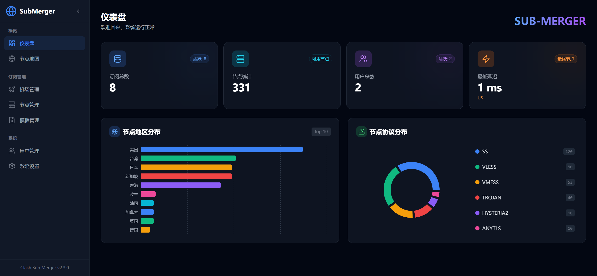
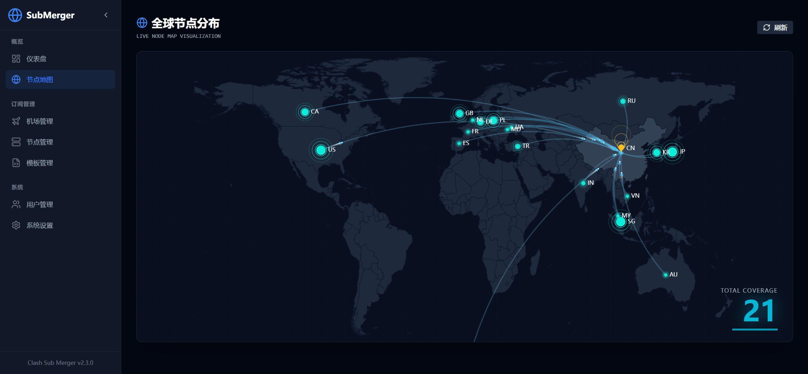
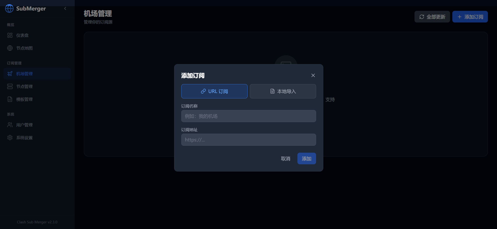
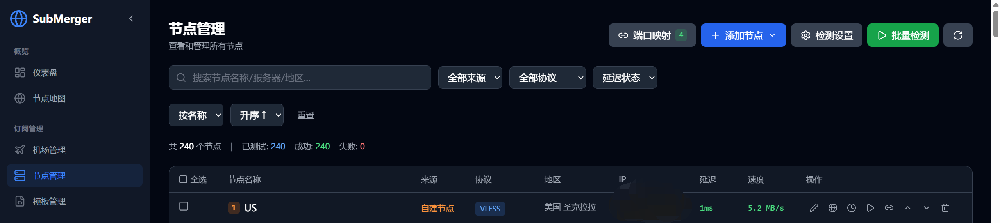
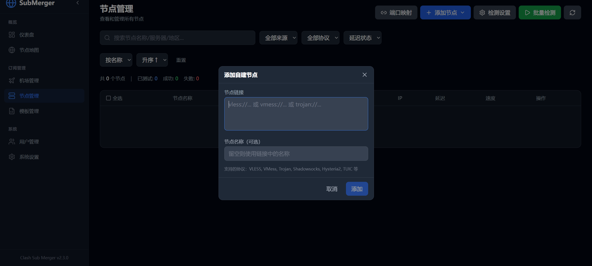
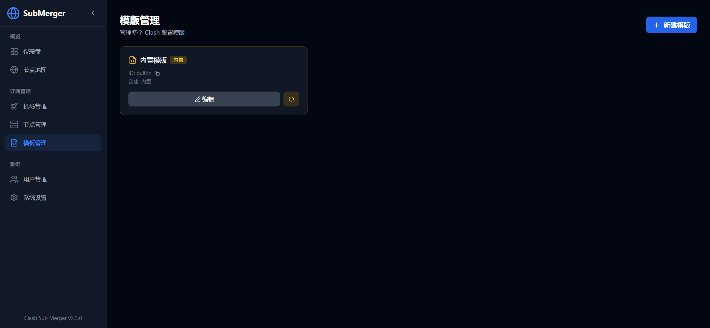
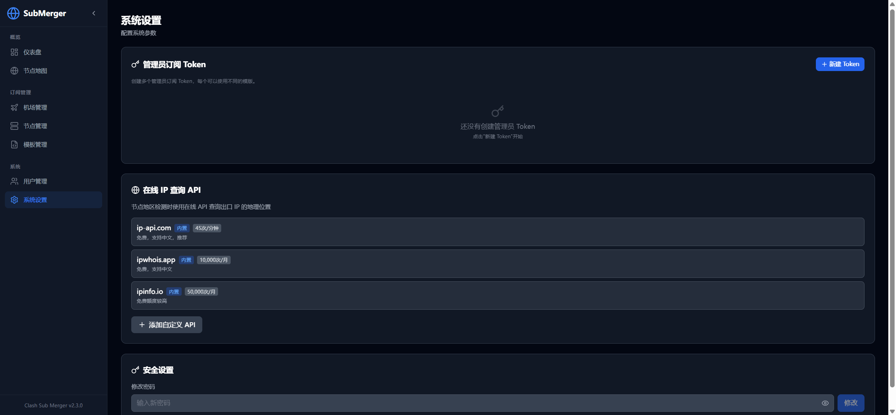
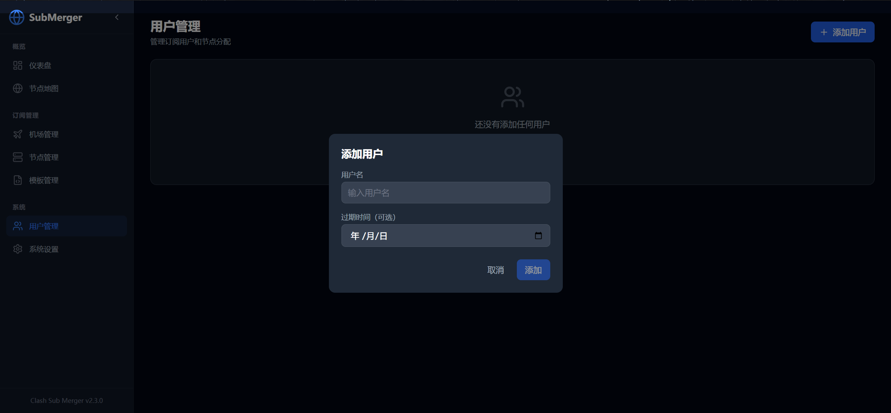

# ✈️ SubMerger

[中文文档](README_CN.md)

A modern and beautiful subscription aggregation management panel for Clash/Mihomo, supporting multi-subscription merging, custom nodes, user management, and smart format output.


## 📸 Screenshots

|               Dashboard               |         Node Map         |
| :-----------------------------------: | :-----------------------: |
|  |  |

|                  Subscriptions                  |             Nodes             |
| :---------------------------------------------: | :---------------------------: |
|  |  |

|              Add Node              |               Templates               |
| :---------------------------------: | :-----------------------------------: |
|  |  |

|              Settings              |             Users             |
| :---------------------------------: | :---------------------------: |
|  |  |

## ✨ Features

### Subscription Management

- 🔗 **Multi-subscription Aggregation** - Merge multiple subscriptions into one
- 🛠️ **Custom Nodes** - Add your own nodes (vmess/vless/ss/trojan/hysteria2, etc.)
- 📁 **Local Import** - Import subscriptions from local YAML/Base64 files
- 🔄 **Auto Refresh** - Scheduled subscription updates with Cron expression
- 📊 **Traffic Statistics** - Display traffic usage and expiration time
- 🎯 **Drag & Drop Sorting** - Customize node order

### Node Management

- 🌍 **Global Node Map** - Interactive ECharts world map visualization
- ⚡ **Go Speedtest Service** - High-performance testing via mihomo library
  - Delay test (TCP latency)
  - Speed test with peak mode
  - Exit IP detection
- 🌐 **Online GeoIP APIs** - No local database needed
  - Built-in: ip-api.com (45 req/min, Chinese), ipwhois.app, ipinfo.io
  - Custom API support with `{ip}` and `{key}` placeholders
  - Token security protection
  - City name translations (Tokyo→东京, Seoul→首尔)
  - Special region display (HK→中国香港, TW→中国台湾)
  - **Async GeoIP lookup** (v2.6.0) - Reduce "unknown" nodes with IP-based country detection
  - **Case-insensitive city mapping** (v2.6.0) - Support all case formats (Boydton/boydton/BOYDTON)
- 🔗 **Proxy Chain** - Create chained proxy configurations (Node A → Node B → Target)
- 🔌 **Port Mapping** - Map nodes to local ports for direct access (generates Clash listeners)
- 🏷️ **Smart Filtering** - Filter by country, protocol, subscription, latency status
- ↕️ **Flexible Sorting** - Sort by name, latency, speed (ascending/descending)
- 📈 **Protocol Distribution** - Pie chart analytics

### Template Management

- 📝 **Custom Templates** - Create and manage Clash configuration templates
- 🔄 **Placeholder System** - Use `{{ALL_PROXIES}}`, `{{COUNTRY_GROUPS}}` for dynamic content
- 📤 **Import/Export** - Upload YAML files or create from scratch

### User Management

- 👥 **Multi-user Support** - Create users with individual subscriptions
- 🎛️ **Node Allocation** - Assign specific nodes/subscriptions to users
- 🎨 **Visual Template Editor** (v2.4.0) - Configure proxy groups for each user with visual interface
  - Edit node selection for each proxy group
  - Real-time YAML preview
  - Support for admin tokens
- ⏱️ **Expiration Control** - Set user expiration dates

### Subscription Output

- 📱 **Smart Format** - Auto-detect client and return YAML or Base64
- 🐱 **One-click Import** - Support `clash://` protocol
- 📷 **QR Code** - Scan to subscribe on mobile
- 📝 **Custom Template** - Customize Clash configuration template

### Security

- 🔐 **Password Protection** - Panel access requires password
- 🎫 **Token Authentication** - Subscription URL with token
- 🔑 **Regenerate Token** - Reset subscription token anytime
- 🧾 **Credential-safe Logging** - Built-in access logs omit token-bearing subscription URLs; reverse proxies should also disable or redact query-string logging

## 🏗️ Architecture

```
┌─────────────────────────────────────────────────────┐
│                    Docker Container                  │
├─────────────────────────────────────────────────────┤
│  ┌─────────────────┐    ┌─────────────────────────┐ │
│  │  Python/FastAPI │◄──►│  Go Speedtest Service   │ │
│  │   (port 8666)   │    │     (port 9876)         │ │
│  │                 │    │  - mihomo library       │ │
│  │  - API Server   │    │  - delay/speed test     │ │
│  │  - Frontend     │    │  - exit IP detection    │ │
│  └─────────────────┘    └─────────────────────────┘ │
└─────────────────────────────────────────────────────┘
```

## 🚀 Quick Deploy

### Docker Compose (Recommended)

1. Create the working directory and `.env`:

```bash
mkdir submerger && cd submerger
cat > .env <<'EOF'
INITIAL_ADMIN_PASSWORD=replace-with-a-password-containing-letters-and-digits
SESSION_SECRET=replace-with-a-long-random-string
TZ=Asia/Shanghai
EOF
```

`INITIAL_ADMIN_PASSWORD` is required only for the first successful initialization. Remove it from the deployment environment after the password hash has been persisted, and never deploy the example value.

2. Create `docker-compose.yml`:

```yaml
services:
  submerger:
    image: ghcr.io/socialyjj/clash-sub-merger:latest
    container_name: submerger
    restart: unless-stopped
    ports:
      - "8666:8666"
    volumes:
      - ./data:/app/data
    env_file:
      - .env
    environment:
      DATA_DIR: /app/data
      HOST: 0.0.0.0
      PORT: 8666
```

3. Start:

```bash
docker compose up -d
```

4. Visit `http://your-ip:8666` and log in with the initial administrator password. The entrypoint creates and validates `data/uploads`, `data/logs`, `data/backups`, and `data/refresh_locks` before dropping privileges.

### Build Manually

```bash
git clone https://github.com/SocialYjj/clash-sub-merger.git
cd clash-sub-merger
cp .env.example .env
# Set INITIAL_ADMIN_PASSWORD in .env first.
docker compose up -d --build
```

## 📖 Usage

### First Time Setup

1. Set `INITIAL_ADMIN_PASSWORD` before the first startup; network-based first setup is disabled
2. Add subscriptions or custom nodes
3. Click "Subscribe" button to get the aggregated URL

### Subscription Format

| Client              | Format      | Note                                   |
| ------------------- | ----------- | -------------------------------------- |
| Clash/FlClash/Stash | YAML        | Auto-detect                            |
| V2RayN/V2RayNG      | Base64      | Auto-detect                            |
| Shadowrocket        | YAML/Base64 | Auto-detect                            |
| Manual              | -           | `?format=yaml` or `?format=base64` |

### Supported Protocols

- VMess
- VLESS (with Reality)
- Shadowsocks (SS)
- ShadowsocksR (SSR)
- Trojan
- Hysteria / Hysteria2
- TUIC
- WireGuard
- AnyTLS
- SOCKS5 / HTTP
- Snell

## 🔧 Configuration

### Environment Variables

| Variable | Default | Description |
| --- | --- | --- |
| `TZ` | `UTC` | Timezone |
| `DATA_DIR` | `/app/data` | Data directory |
| `HOST_PORT` | `8666` | Docker Compose host port |
| `INITIAL_ADMIN_PASSWORD` | required on first start | Initial administrator password |
| `SESSION_SECRET` | empty | Optional session signing secret; recommended in production |
| `SESSION_TTL_SECONDS` | `86400` | Administrator session lifetime in seconds |
| `METRICS_TOKEN` | empty | Dedicated `/metrics` token; empty disables the endpoint |
| `MAX_REQUEST_SIZE` | `10485760` | Maximum HTTP request body size in bytes |
| `SUBSCRIPTION_MAX_BYTES` | `10485760` | Maximum decoded subscription response size in bytes |
| `SUBSCRIPTION_FETCH_RETRIES` | `1` | Extra retries for transient subscription fetch failures |
| `SUBSCRIPTION_FETCH_RETRY_DELAY_SECONDS` | `1` | Base delay before a transient fetch retry |
| `SUBSCRIPTION_REFRESH_CONCURRENCY` | `4` | Maximum concurrent items in “refresh all” |
| `FILE_LOCK_TIMEOUT` | `10` | Wait limit for a refresh/configuration file lock |
| `SCHEDULED_REFRESH_WORKERS` | `4` | Worker threads for scheduled refreshes |
| `SCHEDULED_REFRESH_MISFIRE_GRACE_SECONDS` | `300` | Grace period for a delayed scheduled refresh |
| `SCHEDULED_REFRESH_JITTER_SECONDS` | `120` | Random staggering window for jobs sharing the same Cron time |
| `RATE_LIMIT_GEOIP` | `30/minute` | Limit for GeoIP lookup and API-test endpoints |
| `CUSTOM_GEOIP_MAX_RESPONSE_BYTES` | `1048576` | Maximum custom GeoIP API response size in bytes |

Scheduled jobs configured for the same time, such as `0 0 * * *`, run within the jitter window instead of all starting at exactly midnight.

### Data Persistence

All data is stored in `/app/data`:

- `config.json` - Configuration (subscriptions, nodes, auth)
- `uploads/` - Subscription cache files
- `logs/` - Rotating, credential-redacted application logs
- `backups/` - Configuration backups
- `refresh_locks/` - OS-backed refresh lock files; file presence alone does not mean a lock is held

Back up the complete `data/` directory before upgrades. Saved subscription-fetch and IPv6-test proxy credentials are write-only: the API reports only whether a value exists, so replace or clear them instead of reading them back. Configuration exports and backups are full migration data containing password hashes and subscription tokens and must be protected as sensitive files; login sessions are neither exported nor restored.

Delete historical application or reverse-proxy logs and rotate credentials if an older release logged full subscription URLs, tokens, or proxy credentials. For a custom non-root container, make the bind mount writable by UID 1000.

## 🛠️ Development

### Backend

```bash
# Create virtual environment
uv venv
.venv\Scripts\activate  # Windows
source .venv/bin/activate  # Linux/Mac

# Install dependencies
uv pip install -r requirements.txt

# Run server
python server.py
```

### Frontend

```bash
cd submerger
npm install
npm run dev
```

### Build Frontend

```bash
cd submerger
npm run build
```

## 📄 License

[Apache License 2.0](LICENSE)
